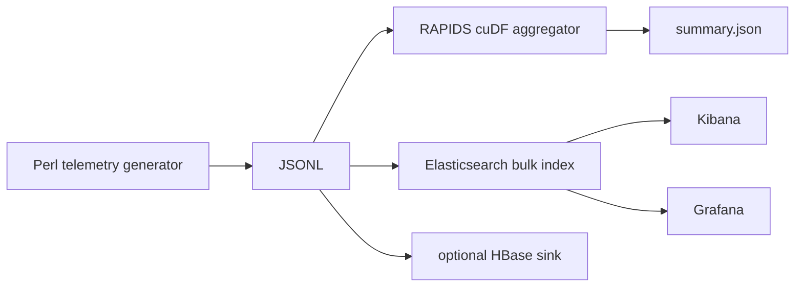

# GPU Telemetry Pipeline — RAPIDS + Elastic + Grafana

A compact observability/data-engineering project that ingests JSONL telemetry, accelerates feature aggregation with RAPIDS cuDF when a GPU is available, indexes records into Elasticsearch, and visualizes the same stream through Kibana/Grafana.

## Stack

RAPIDS cuDF · Elasticsearch · Kibana · Grafana · HBase (optional sink) · Docker Compose · Perl log generator

## Pipeline



## Quickstart

Generate sample telemetry:

```bash
perl tools/generate_logs.pl 5000 > sample.jsonl
```

Run the GPU-aware aggregator:

```bash
python telemetry_pipeline.py sample.jsonl --summary summary.json
```

If cuDF is installed, aggregation runs on the GPU; otherwise the script falls back to pandas so the project remains testable on non-GPU machines.

Start the local observability stack:

```bash
docker compose up -d
python telemetry_pipeline.py sample.jsonl --elasticsearch http://localhost:9200 --index gpu-telemetry
```

## Features

- GPU dataframe acceleration through RAPIDS/cuDF
- pandas fallback for portability
- throughput/error/latency aggregation by service and GPU
- Elasticsearch Bulk API indexing
- Kibana and Grafana services via Compose
- optional HBase REST sink helper
- Perl-based synthetic telemetry generator for repeatable demos

## Resume-safe description

Built a GPU-aware telemetry analytics pipeline using RAPIDS cuDF with pandas fallback, Elasticsearch bulk indexing, Kibana/Grafana visualization, and optional HBase persistence; added reproducible synthetic workload generation in Perl.

## Notes

This repo measures and reports values from generated or supplied telemetry. It does not claim production-scale benchmark numbers.

## License

MIT
